# SANYALnet Labs Ludo AI Arena

> Cross-platform desktop Ludo with four autonomous AI players (NVIDIA NIM + deterministic local
> fallback). C# / .NET 10 / Avalonia. Built by ChatDev 2.0; verified on Linux, Windows and macOS
> across x64 and arm64. &mdash; <https://github.com/tuklusan/Ludo-Arena>

📖 **Written up as a blog series — start at
[Part 1: Install ChatDev 2.0 on Linux](https://supratim-sanyal.blogspot.com/2026/07/install-chatdev-ai-agents-linux_01345372577.html).**

A polished, cross-platform desktop **Ludo** game in which **four autonomous AI players** play a
full match automatically — animated die, tokens gliding cell by cell, captures, blockades, bonus
rolls and a winner screen. Each player consults a language model (via the OpenAI-compatible
**NVIDIA NIM** API) to pick its move from an engine-generated list of legal moves, and the whole
thing falls back to a deterministic local AI the instant the network misbehaves.

Built in **C# on .NET 10 with Avalonia UI**. One codebase, one build command, a native window on
Linux, Windows and macOS.

> Solution/assembly identifiers use `LudoNimArena`; all user-visible header/title text reads
> "SANYALnet Labs Ludo AI Arena".

## Screenshots

Thirteen platforms, one game each. Every image is the **final board of a complete game** — first
roll to declared winner — rendered by the application itself on that machine, so the winning
player's card reads `Done:4`. The winners and turn counts all differ because each is a genuinely
independent game; the die uses a cryptographic RNG.

### Linux

| Ubuntu 24.04 · x64 | Ubuntu 24.04 · **arm64** |
|:--:|:--:|
| 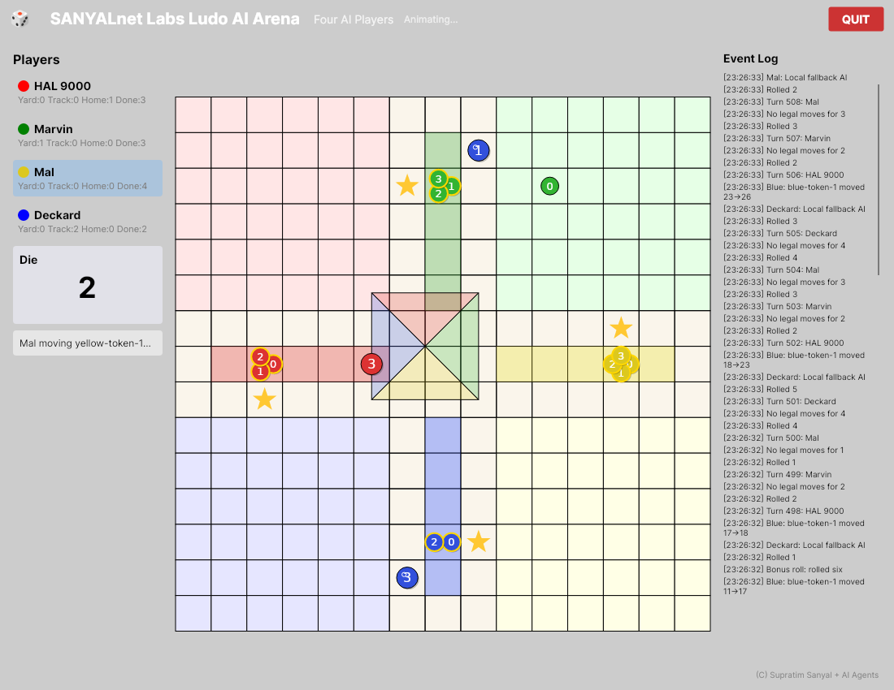 | 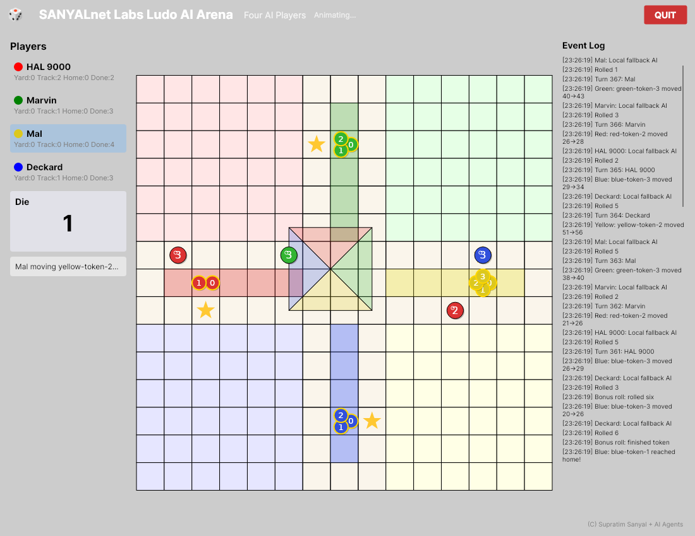 |
| Mal (Yellow) — 508 turns | Mal (Yellow) — 367 turns |

| Ubuntu 22.04 · x64 | Ubuntu 22.04 · **arm64** |
|:--:|:--:|
| 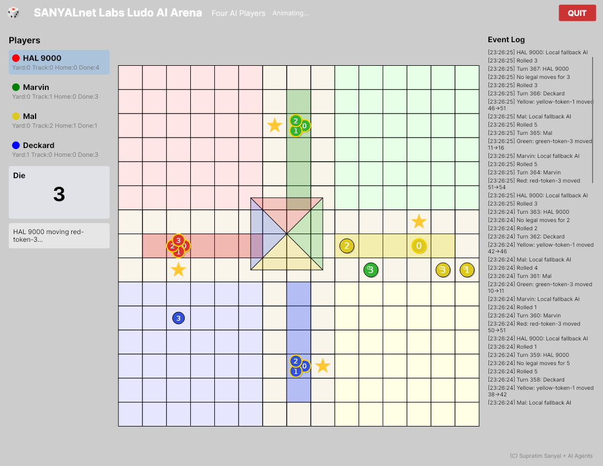 | 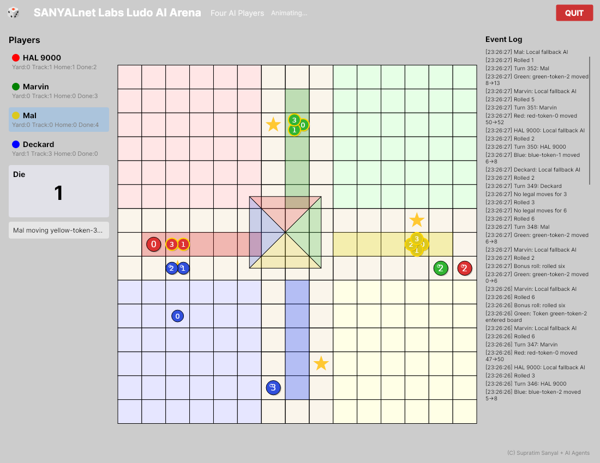 |
| HAL 9000 (Red) — 367 turns | Mal (Yellow) — 352 turns |

### Windows

| Windows Server 2025 · x64 | Windows Server 2022 · x64 |
|:--:|:--:|
| 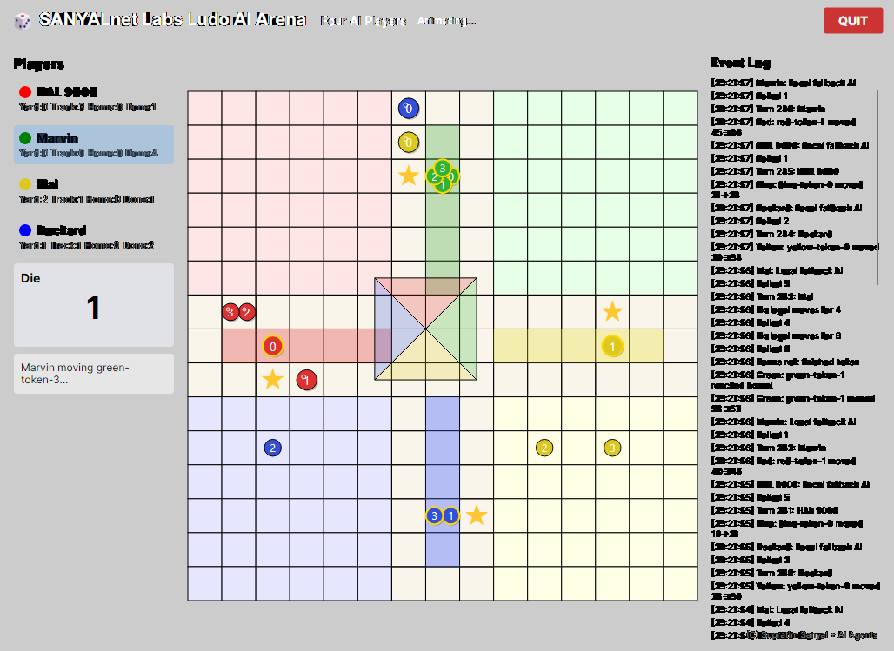 | 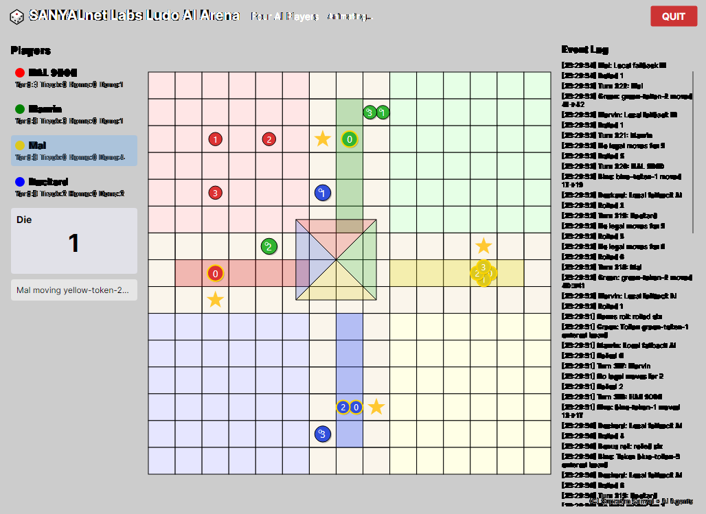 |
| Marvin (Green) — 246 turns | Mal (Yellow) — 322 turns |

| Windows 11 on Arm · **arm64** | Windows 10 · x64 *(physical machine)* |
|:--:|:--:|
| 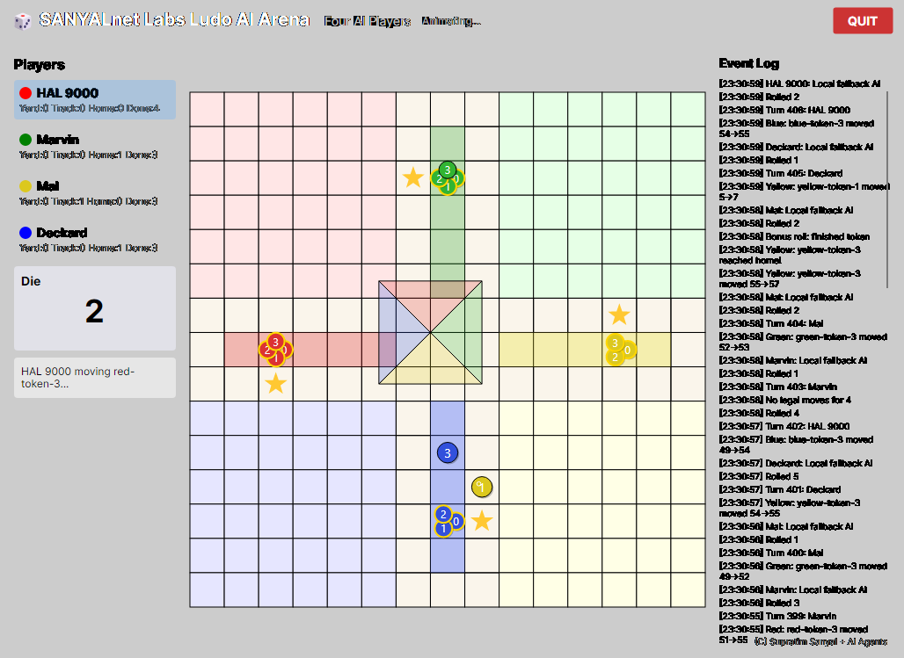 | 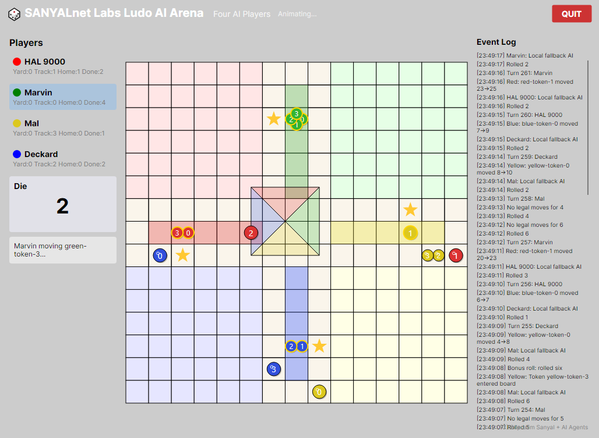 |
| HAL 9000 (Red) — 406 turns | Marvin (Green) — 261 turns |

### macOS

| macOS 15 · Apple Silicon | macOS 14 · Apple Silicon |
|:--:|:--:|
| 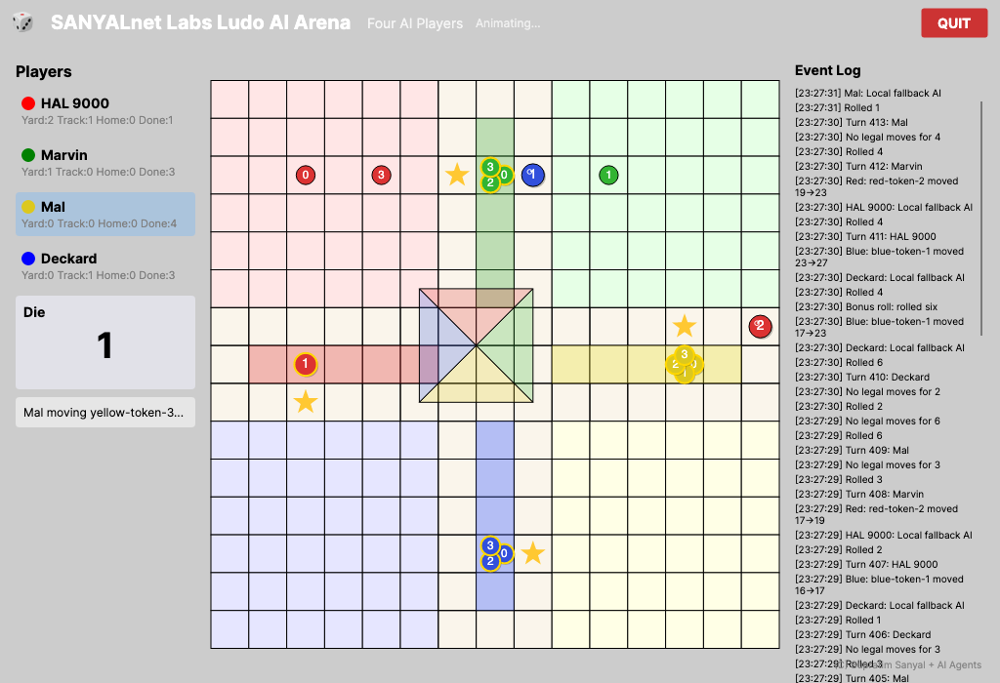 | 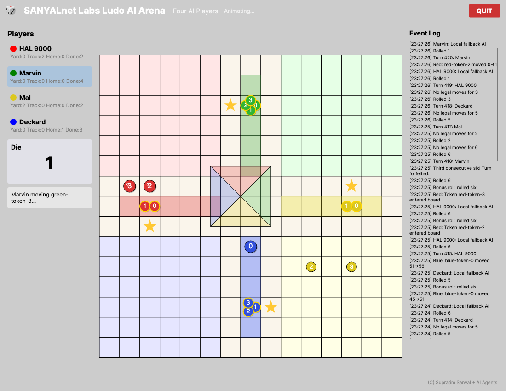 |
| Mal (Yellow) — 413 turns | Marvin (Green) — 420 turns |

| macOS 15 · Intel x64 | macOS Big Sur 11.7.11 · Intel *(physical machine)* |
|:--:|:--:|
| 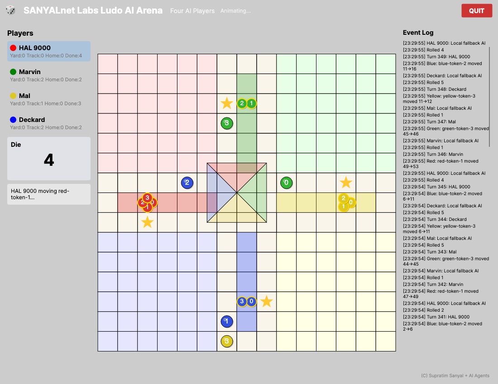 | 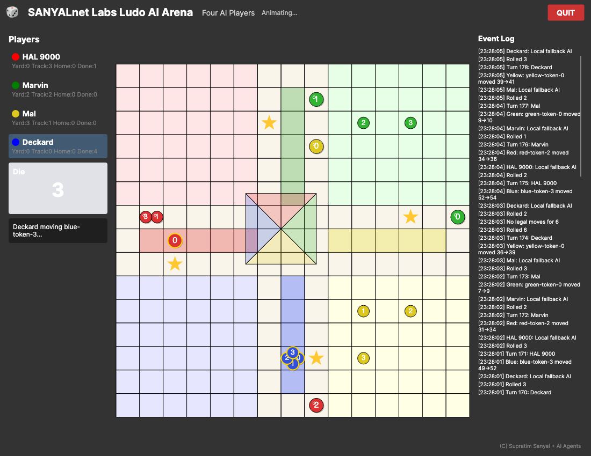 |
| HAL 9000 (Red) — 349 turns | Deckard (Blue) — 178 turns · *dark mode, following the host's appearance* |

### Physical Linux desktop

| Ubuntu · x64 *(physical machine)* |
|:--:|
| 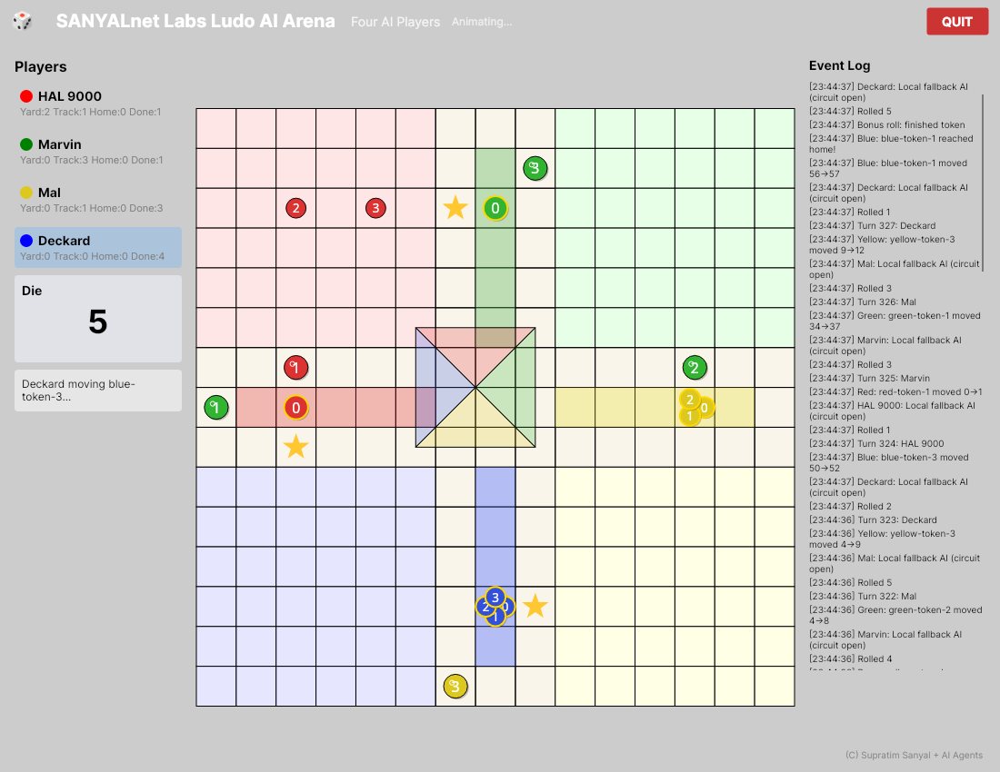 |
| Deckard (Blue) — 327 turns |

[`screenshots/MANIFEST.txt`](screenshots/MANIFEST.txt) lists every image with its platform, winner
and turn count.

## Features

- Exactly four autonomous AI players (Red, Green, Yellow, Blue), four tokens each, automatic play
  from an animated roll-off to victory.
- A separate NVIDIA NIM decision session per player (isolated persona, history and counters).
- A complete deterministic **local fallback AI** that can finish a whole game with no network.
- "Indian Digital Classic" rule profile: six-to-enter, bonus roll on six/capture/finish,
  three-consecutive-sixes ends the turn, safe squares, blockades, exact roll to finish.
- A 15×15 board drawn with Avalonia vector APIs; smooth interpolated token movement; a die that
  flashes without ever resizing or reflowing the board.
- Per-player "last decision source" indicator (NIM vs. local fallback), a scrollable event log,
  and an always-visible QUIT.
- Cancellation-aware retry, throttling and a circuit breaker around the NIM client (handles
  HTTP 429/529, `Retry-After`, long server waits) — the UI never freezes on the network.

## Download — v1.0.0

Prebuilt packages for six platform/architecture combinations are on the
[**Releases**](https://github.com/tuklusan/Ludo-Arena/releases/latest) page.

| Platform | x64 | arm64 |
|---|---|---|
| Linux | `LudoArena-1.0.0-linux-x64.tar.gz` | `LudoArena-1.0.0-linux-arm64.tar.gz` |
| Windows | `LudoArena-1.0.0-win-x64.zip` | `LudoArena-1.0.0-win-arm64.zip` |
| macOS | `LudoArena-1.0.0-osx-x64.tar.gz` | `LudoArena-1.0.0-osx-arm64.tar.gz` |

These are **minimal, framework-dependent** builds — roughly 10–13 MB, because they use the .NET 10
runtime you already have rather than bundling their own copy. There is no installer: extract the
archive and run the binary. Nothing is written outside the folder, no registry keys are added and no
services are installed, so uninstalling is deleting the folder.

**Prerequisite:** the [.NET 10 Desktop Runtime](https://dotnet.microsoft.com/download/dotnet/10.0)
(`dotnet --list-runtimes` to check).

```bash
# Linux / macOS
tar -xzf LudoArena-1.0.0-linux-x64.tar.gz -C ludo-arena && cd ludo-arena
chmod +x LudoNimArena.App        # archives are built on Windows; restore the exec bit
./LudoNimArena.App
```

```powershell
# Windows
Expand-Archive LudoArena-1.0.0-win-x64.zip -DestinationPath ludo-arena; cd ludo-arena
.\LudoNimArena.App.exe
```

Each archive contains `INSTALL.txt` and `LICENSE`. Verify a download against `SHA256SUMS.txt`:

```bash
sha256sum -c SHA256SUMS.txt --ignore-missing
```

Two platform notes. On **macOS**, Gatekeeper quarantines downloaded files — clear it with
`xattr -dr com.apple.quarantine .` in the extracted folder. On **Windows 11**, Smart App Control (if
enforcing) refuses to load unsigned binaries and the app will not start, reporting
`An Application Control policy has blocked this file (0x800711C7)`; this affects any unsigned build.
Building from source, as below, avoids both.

## Requirements

- **.NET 10 SDK** (`net10.0`). Verify with `dotnet --info`.
- A desktop environment (Linux X11/Wayland, Windows, or macOS).
- Optional: an **NVIDIA NIM** API key for live model-driven moves. Without one the game runs on
  the local fallback AI.

## Build and run

```bash
# from the repository root
dotnet restore LudoNimArena.slnx
dotnet build   LudoNimArena.slnx -c Release
dotnet run --project src/LudoNimArena.App -c Release
```

On Windows use `src\LudoNimArena.App`. The setup screen opens; press **START GAME**.

On a minimal Linux desktop with no GPU driver, force software rendering so Avalonia's Skia backend
paints reliably:

```bash
export LIBGL_ALWAYS_SOFTWARE=1 GALLIUM_DRIVER=llvmpipe
dotnet run --project src/LudoNimArena.App -c Release
```

## NVIDIA NIM configuration (environment variables only)

The application reads all NVIDIA settings **from the environment** — no key is ever stored in
source, config, logs or artifacts. Set at least `NVIDIA_API_KEY` for live decisions:

| Variable | Purpose |
|---|---|
| `NVIDIA_API_KEY` | Bearer key for the NIM endpoint (required for live moves). |
| `NVIDIA_MODEL` | Move-picker model, e.g. a small non-reasoning instruct model. |
| `NVIDIA_SECONDARY_MODEL` | Optional hosted failover; empty = skip straight to local fallback. |
| `NVIDIA_BASE_URL` | OpenAI-compatible base URL (keep the `/v1` path segment). |
| `NVIDIA_REQUEST_TIMEOUT_SECONDS` | Per-request timeout. |
| `NVIDIA_MIN_CALL_INTERVAL_SECONDS` | Request spacing to stay under the tier's rate ceiling. |
| `NVIDIA_MAX_RETRY_ELAPSED_SECONDS` | Total retry budget before falling back locally. |
| `NVIDIA_CIRCUIT_BREAKER_SECONDS` | How long the circuit stays open after repeated failures. |

```bash
export NVIDIA_API_KEY='...'                                  # your key — never commit it
export NVIDIA_MODEL='nvidia/nemotron-mini-4b-instruct'       # small, non-reasoning, fast
dotnet run --project src/LudoNimArena.App -c Release
```

If the key is missing or a model is unavailable, the game starts normally, warns, and uses the
local fallback AI. Every move is labelled with its source, so a fully-fallback game is obvious.

## Unattended / automated play

All of the following are **opt-in**. With none of them set the game behaves exactly as it does for a
human player — normal pacing, waiting for you to press START GAME.

| Variable | Purpose |
|---|---|
| `LUDO_AUTOSTART=1` | press START GAME automatically shortly after the window opens |
| `LUDO_SPEED=<n>` | animation-speed multiplier; `1` is human pace, `15` is watchable, `80` is fast |
| `LUDO_TRANSCRIPT=<path>` | append every event-log line to a file (the on-screen log keeps only the last 100 lines; the transcript keeps everything) |
| `LUDO_EXIT_ON_GAMEOVER=1` | close the application once a winner is declared, giving a clean exit code |
| `LUDO_SCREENSHOT=<prefix>` | save `<prefix>-001.png`, `-002.png`, … while playing and `<prefix>-final.png` at the winner screen |
| `LUDO_SCREENSHOT_INTERVAL=<secs>` | how often to grab a frame (default 25) |

Play one complete game unattended and leave machine-checkable proof behind:

```bash
LUDO_AUTOSTART=1 LUDO_SPEED=80 LUDO_EXIT_ON_GAMEOVER=1 \
LUDO_TRANSCRIPT=./proof/transcript.txt LUDO_SCREENSHOT=./proof/board \
  dotnet run --project src/LudoNimArena.App -c Release
```

The transcript ends with a fixed, greppable footer:

```
WINNER: Marvin (Green)
TURNS: 295
GAME COMPLETE
```

Screenshots are produced by the application rendering its own window (Avalonia
`RenderTargetBitmap`), not by an OS screen-capture tool — so they work with no attached display,
under a virtual X server, and from a non-interactive service session.

On a headless Linux machine, run the real GUI inside a virtual X server:

```bash
xvfb-run -a --server-args="-screen 0 1280x900x24" dotnet run --project src/LudoNimArena.App -c Release
```

## Project structure

```
LudoNimArena.slnx               # solution
Directory.Build.props           # shared MSBuild settings (net10.0, nullable, implicit usings)
Directory.Packages.props        # centrally pinned package versions
NuGet.config                    # pins nuget.org, clears inherited sources (reproducible restore)
global.json                     # pinned .NET 10 SDK (10.0.302, latestPatch roll-forward)
src/LudoNimArena.Core           # rules, board geometry, state, legal moves, die abstractions
src/LudoNimArena.AI             # NIM client, per-player sessions, DTOs, local fallback AI
src/LudoNimArena.App            # Avalonia startup, MVVM, board rendering, animation
tests/                          # Core / AI / App test projects
scripts/check_license_headers.sh# license-header gate (also enforced in CI)
scripts/  *.py  env_check.sh    # build and environment-inspection harnesses
docs/REQUIREMENTS_PROMPT.md     # the exact specification the build was driven from
.github/workflows/              # CI: header gate, runner probe, full-game runs
LICENSE                         # SANYALnet Labs non-commercial license
```

Every source file carries the license header, and
[`scripts/check_license_headers.sh`](scripts/check_license_headers.sh) fails the build if one is
missing. It runs on every push and pull request.

## Tests

```bash
dotnet test LudoNimArena.slnx -c Release
```

**71 tests** — Core 52, AI 11, App 8. The Core tests include deterministic four-player fallback
simulations that check board invariants after every move; the App tests use Avalonia's headless
platform.

## Cross-platform verification

The **identical source** in this repository — no platform-specific code, no conditional compilation
— builds and plays a complete game on three operating systems and two CPU architectures.

CI does not merely compile it: on every runner it builds Release, runs all 71 tests, then **launches
the real Avalonia application** and plays one full game from first roll to declared winner, checking
the transcript and uploading it with board screenshots as artifacts. Linux runners have no display,
so the real GUI runs inside a virtual X server.

| Platform | x64 | arm64 |
|---|---|---|
| Linux (Ubuntu 22.04 / 24.04) | ✅ | ✅ |
| Windows (Server 2022 / 2025, Windows 11 on Arm) | ✅ | ✅ |
| macOS (14 / 15, Intel and Apple Silicon) | ✅ | ✅ |

Also verified on physical machines: a Linux desktop, Windows 10, and macOS Big Sur 11.7.11 — the
last of which is a 2020 release still running the current .NET 10 SDK (10.0.302) and Avalonia 11.2.8.
See `screenshots/`, and the workflows in [`.github/workflows/`](.github/workflows/).

> **Note for Windows 11 users:** Smart App Control, when enforcing, refuses to load locally-built
> unsigned assemblies and the game will fail to start with
> `An Application Control policy has blocked this file (0x800711C7)`. This affects any unsigned
> build, not just this one. Signing with a reputable certificate is the proper fix.

## Origin

This game was built by **ChatDev 2.0**, a multi-agent "virtual software company," from the
specification in [`docs/REQUIREMENTS_PROMPT.md`](docs/REQUIREMENTS_PROMPT.md) — five free models
failed at it, and one paid DeepSeek run costing about a dollar shipped it.

The whole story is written up as a blog series on
[Supratim Sanyal's Blog](https://supratim-sanyal.blogspot.com/). **Start here:**

> ### 📖 [Part 1 — Install ChatDev 2.0 on Linux: AI Agents That Build Real Software](https://supratim-sanyal.blogspot.com/2026/07/install-chatdev-ai-agents-linux_01345372577.html)

The series then builds progressively: Part 2 has the agents build a live AI news debate wall,
Part 3 covers this game — the model shoot-out and the two silent bugs a green build hid — and
Part 4 turns it into this public repository and proves it on every GitHub runner and CPU
architecture.

## License

Copyright (c) 2026 Supratim Sanyal of SANYALnet Labs. Released for **non-commercial** use under the
terms in [`LICENSE`](LICENSE). Attribution required: *"Based on original work by Supratim Sanyal of
SANYALnet Labs."*
